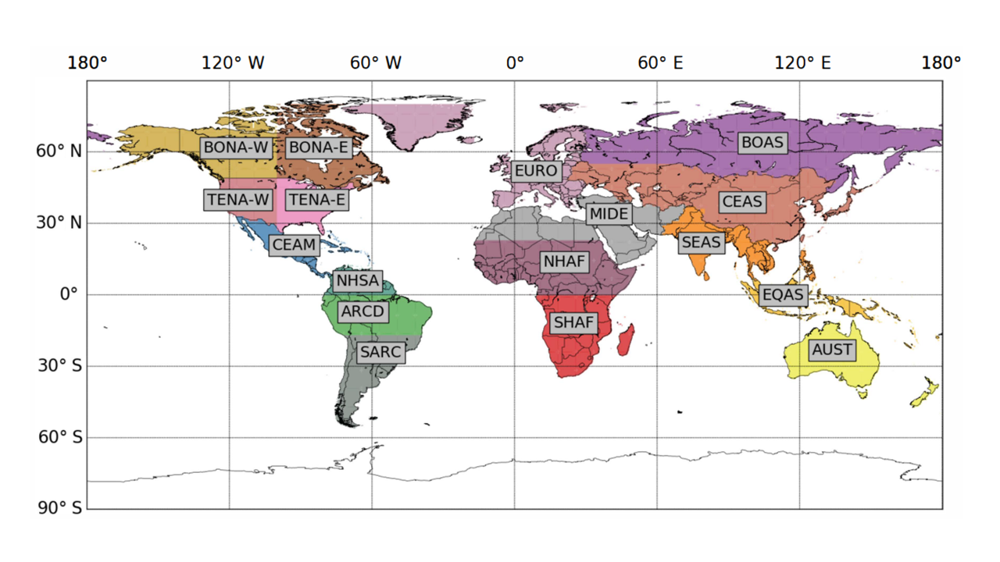
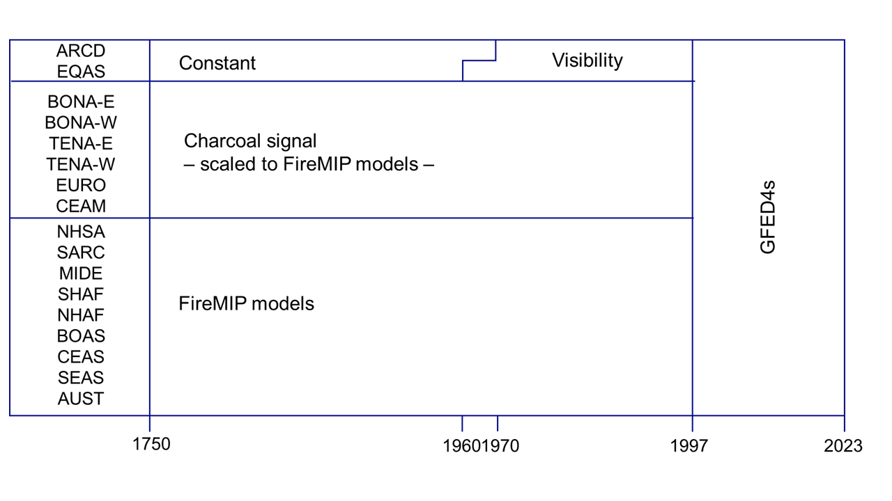
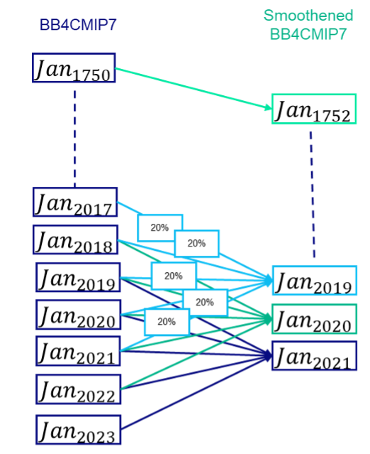

<!--- These values are used by `fill-out-auto-generated-sections.py` -->
<!--- forcing="biomass_burning_emms" -->
<!--- source_id_stub="DRES-CMIP-BB4CMIP7" -->
# Open biomass burning emissions

## Key contacts

- Names: Margreet van Marle, Guido van der Werf
- Emails: Margreet.vanMarle@Deltares.nl; Guido.vanderWerf@wur.nl

## Summary

<!--- begin-cmip7-phases-source-ids -->
<!--- Do not edit this section, it is automatically updated when the docs are built -->
### Source IDs for CMIP7 phases

The source ID that identifies the dataset to use in CMIP7 is given below.

#### CMIP7

For the CMIP7 phase of CMIP7, use data with the source ID [DRES-CMIP-BB4CMIP7-2-0](https://aims2.llnl.gov/search?project=input4MIPs&versionType=all&&activeFacets=%7B%22source_id%22%3A%5B%22DRES-CMIP-BB4CMIP7-2-0%22%5D%7D)

This data is for use in CMIP7 production simulations.
All data sets for use in CMIP7 production simulations are published with a `mip_era` metadata value of 'CMIP7'.
This metadata value appears both in the file's global metadata as well as its metadata on ESGF.

If you find an issue, please
[create an issue on GitHub](https://github.com/PCMDI/input4MIPs_CVs/issues/new?template=data_issue.md)
so that the identification and resolution of this issue is publicly accessible.

#### Testing

For the testing phase of CMIP7, use data with the source ID [DRES-CMIP-BB4CMIP7-1-0](https://aims2.llnl.gov/search?project=input4MIPs&versionType=all&&activeFacets=%7B%22source_id%22%3A%5B%22DRES-CMIP-BB4CMIP7-1-0%22%5D%7D)

This data is for testing (both of the forcing data and of modelling workflows) only.
Production simulations should not be started based on any data that has a `mip_era` value equal to 'CMIP6Plus'.
(The `mip_era` metadata value appears both in each file's global attributes as well as its metadata on ESGF.)

If you have any feedback, please add it to the [relevant GitHub discussion](https://github.com/PCMDI/input4MIPs_CVs/discussions).

<!--- end-cmip7-phases-source-ids -->

## Navigating the data

This documentation supports the Open Biomass Burning Emissions dataset 
developed for the Coupled Model Intercomparison Project (CMIP7) simulations,
including the smoothed version of all variables.
The smoothed version of all variables is indicated by the inclusion of `smoothed` in the variable name.
It was constructed to dampen the large interannual variability in biomass burning emissions, especially in the satellite era (1997 onwards).
The large interannual variability is partly related to interannual variability in drought conditions,
which likely cause a mismatch with climate models when not based on prescribed climate conditions.

The dataset consists of:

* Monthly estimates of open biomass burning emissions (forests, grasslands, agricultural waste burning on fields, peatlands)
* Emission species: BC, OC, CO2, SO2, N2O, NOx, NH3, CH4, CO, NMVOC, H2
* NMVOC consists of the sum of: 
  C2H6, CH3OH, C2H5OH, C3H8, C2H2, C2H4, 
  C3H6, C5H8, C10H16, C7H8, C6H6, C8H10, 
  Toluenelump, HigherAlkenes, HigherAlkanes, CH2O, C2H4O, C3H6O, C2H6S, HCN, HCOOH, CH3COOH, MEK, CH3COCHO, HOCH2CHO. 
  These NMVOCs are also provided separately.
* Partitioning of bulk emissions related to different sectoral emissions. 
  The different sectors are: 
  SAVA (Savanna, grassland, and shrubland fires), 
  BORF (Boreal forest fires), 
  TEMF (Temperature forest fires), 
  DEFO (Tropical forest fires [deforestation and degradation]), 
  PEAT (Peat fires), 
  AGRI (Agricultural waste burning)

### Data sources

The BB4CMIP historic biomass burning emissions dataset 
starting from January 1750 merges satellite records with several existing proxies (visibility, charcoal data) 
and utilizes the average of six models from the Fire Model Intercomparison Project (FireMIP) protocol 
to estimate emissions when proxy coverage is limited. 
Figure 1 and Figure 2 provide more information on which proxies were used in various basis regions to construct the full time series. 
This has been further explained in Van Marle et al. (2017, https://doi.org/10.5194/gmd-10-3329-2017).

Figure 1: The 17 basis regions used to reconstruct fire emissions.

Figure 2: Data sources used for each region per time period.

### Interannual variability and climate models

For the time period between 1997 and 2023 the BB4CMIP7 has relatively large interannual variability due to the variability in climate variables 
(e.g. temperature, droughts, variation in El Niño Southern Oscillation), but also human activities and variability in lightning. 
Also before 1997 interannual variability exists due to the variability in Equatorial Asia and the Amazon, where fire emissions are estimated based on visibility data.

An overview of the different data sources used to construct BB4CMIP7, 
their geographical extent used in BB4CMIP and description of the interannual variability per data source
is provided below.

1. GFED4s
    - geographical extent: global
    - interannual variability: Satellite-based and contains interannual variability resulting from low- and high fires years (for example due to ENSO variability)

1. Visibility
    - geographical extent: Equatorial Asia, Amazon
    - interannual variability: Visibility-based dataset which distinguishes between high- and low fire years. 

1. Charcoal signal
    - geographical extent: Boreal North America, Temperate North America, Central America, Europe
    - interannual variability: Smoothed dataset with no interannual variability.

1. FireMIP models
    - geographical extent: Northen Hemisphere, South America, South of Arc of Deforestation, Middle-East, Africa, Boreal Asia, Central Asia, South East Asia, Australia
    - interannual variability: The interannual variability is based on the median of 6 different fire models (SIMFIRE, CLM, INFERNO, JSBACH, LPJ-GUESS-SPITFIRE, ORCHIDEE).

Climate modelling groups using the BB4CMIP7 dataset indicated that spurious signals appear due to this variability. The smoothed dataset should remedy this situation.

###	Calculation of the smoothed dataset

Since the interannual variability is also characteristic for wildfires and to be able to provide realistic outcomes,
an imposed climatology or just decadal averaging would lose information on the emissions. 
Therefore we use the following smoothing procedure:

1. For the time period from 1751 to 2021
1. For January through to December
1. The smoothed gridded emissions are the average of the 5 years either side of the year and month of interest (i.e. $smoothed(cell, month, year) = \frac{\sum_{year - 2}^{year+2} raw(cell, month, year)}{5}$)
1. The emissions for 1750 and 1751 and are kept constant at 1750 and 1751 values
1. There is no smoothed data available for 2022 and 2023

Figure 3: Schematic approach for constructing the smoothed BB4CMIP7

### Data usage notes

- This dataset is made available as forcing dataset 
  for the Coupled Model Intercomparison Project Phase (CMIP7) analyses on the ESGF
  ([https://esgf-node.llnl.gov/search/input4mips/](https://esgf-node.llnl.gov/search/input4mips/)) 
  and is only needed for models that do not simulate fire emissions. 
  Emissions are bulk values for all biomes, 
  ancillary datasets with contribution of emissions 
  related to agricultural waste burning, fires used in deforestation, boreal forest fires, 
  peat fires, savanna fires and temperate forest fires are provided per species.

- The smoothed dataset contains less interannual variability than the non-smoothed dataset 
  and is specifically developed for the CMIP7 runs. 
  We don’t recommend using this dataset for other applications. 

- Models that have their own fire model but do not simulate anthropogenic fires 
  are advised to use only the emissions related to deforestation and agricultural waste burning. 
  We provide the fraction of emissions associated with this.

- Beware of carbon double counting: be careful to not double count deforestation carbon emissions. 
  They are included in the estimates 
  but several models also have deforestation carbon emissions based for example on historical deforestation rates.

- While the large interannual variability is a key feature of global fire emissions, 
  modellers may consider using the 5-year smoothened average
  to filter out this fire signal to avoid having interannual variability in climate and in fires being out of sync.

- While using: Please check if the global annual emissions for the first and last year of the file are correct. 
  These are provided in the attributes \[annual\_total\_first\_year\_Tg\_yr\] and \[annual\_total\_last\_year\_Tg\_yr\]

- The data after 2016 is based on GFED4s (van der Werf, 2017) 
  and is not based on burned area anymore due to a switch in MODIS burned area collections. 
  GFED4s used collection 5.1 which was superceded by collection 6. 
  Emissions for the post-2016 period are based on MODIS active fire detections 
  and a grid-cell specific active fire to carbon emissions conversion based on the 2003-2016 overlapping period.

- The vertical distribution for biomass burning emissions are unspecified. 
  GFDL chose to use the distributions recommended by Table 4 in [Dentener et al. (2006)](https://doi.org/10.5194/acp-6-4321-2006).

Molecular weights for all species are listed in the following table:
Note that NOx has different units in anthropogenic vs open burning data.

| Species (bulk)            | Molecular weight (g) | Species (NMVOC)                                   | Molecular weight (g) |
| ------------------------- | -------------------- | ------------------------------------------------- | -------------------- |
| CO2            | 44.01                | C2H6 (ethane)               | 30.07                |
| CO                        | 28.01                | CH3OH (methanol)                       | 32.04                |
| CH4            | 16.04                | C2H5OH (ethanol)            | 46.07                |
| NMHC                      | 15                   | C3H8 (propane)              | 44.1                 |
| H2             | 2.02                 | C2H2 (acetylene)            | 26.04                |
| NOx (as NO)*   | 30.01                | C2H4 (ethylene)             | 28.05                |
| N2O            | 44.01                | C3H6 (propylene)            | 42.08                |
| PM2.5                     | x                    | C5H8 (isoprene)             | 68.12                |
| TPM                       | x                    | C10H16 (terpenes)           | 136.24               |
| TPC (OC+BC)               | 12                   | C7H8 (toluene)              | 92.14                |
| OC                        | 12                   | C6H6 (benzene)              | 78.11                |
| BC                        | 12                   | C8H10 (xylene)              | 106.17               |
| SO2            | 64.02                | Toluene_lump                                      | 12                   |
| NH3 (ammonia)  | 17.03                | Higher_Alkenes                                    | 12                   |
|                           |                      | Higher_Alkanes                                    | 12                   |
|                           |                      | CH2O (formaldehyde)                    | 30.03                |
|                           |                      | C2H4O (acetaldehyde)        | 44.05                |
|                           |                      | C3H6O (acetone)             | 58.08                |
|                           |                      | C2H6S (dms)                 | 62.07                |
|                           |                      | HCN (hydrogen cyanide)                            | 27.02                |
|                           |                      | HCOOH (formic acid)                               | 47.02                |
|                           |                      | CH3COOH (acetic acid)                  | 60.05                |
|                           |                      | MEK (methyl Ethyl Ketone / 2-butanone)            | 72.11                |
|                           |                      | CH3COCHO (methylglyoxal)               | 72.06                |
|                           |                      | HOCH2CHO (hydroxyacetaldehyde)         | 60.05                |

### Species breakdowns

#### Aerosol and aerosol precursor and reactive compounds

Species (12): BC, OC, CO2, SO2, N2O, NOx, NOxasNO2, NH3, CH4, CO, NMVOC, H2

Data volume: ~1.26 GB per species

#### Biomass burning emissions per NMVOC species

Species (25): C2H6, CH3OH, C2H5OH, C3H8, C2H2, C2H4, C3H6, C5H8, C10H16, C7H8, C6H6, C8H10, Toluenelump, HigherAlkenes, HigherAlkanes, CH2O, C2H4O, C3H6O, C2H6S, HCN, HCOOH, CH3COOH, MEK, CH3COCHO, HOCH2CHO

Data volume: ~1.26 GB per species

#### Partitioning of bulk emissions related to different sectoral emissions

For each species given above,
the percentage of emissions from specific sectors is provided:

1. SAVA (Savanna, grassland, and shrubland fires)
1. BORF (Boreal forest fires)
1. TEMF (Temperature forest fires)
1. DEFO (Tropical forest fires [deforestation and degradation])
1. PEAT (Peat fires)
1. AGRI (Agricultural waste burning)

This results in 222 additional datasets (37 variables times 6 sectors per variable).

Data volume:

1. SAVA: ~780 MB per species
1. BORF: ~311 MB per species
1. TEMF: ~316 MB per species
1. DEFO: ~300 MB per species
1. PEAT: ~300 MB per species
1. AGRI: ~797 MB per species

#### Data source and grid cell area

Two additional files are provided.

Grid cell area is straighfoward.
Only one file is provided as the grid for all data is the same.

The data source file provides information about the data source used for each cell.
The different values are described in the metadata of the provided file.
In short, this file distinguishes whether the data is based on 
e.g. GFED, FireMIP, visibility records.

Data volume:

1. grid cell area: 42 kB
1. data source: 123 MB

### Recommendation for pre-industrial control

Apply the 1850 values on repeat.

<!--- begin-revision-history -->
<!--- Do not edit this section, it is automatically updated when the docs are built -->
## Revision history

### DRES-CMIP-BB4CMIP7-1-0

Differences with CMIP6-1-2: The dataset contains data until December 2022 based on GFED4s Global
Fire Emissions. Furthermore CO2 has been added as separate species. This dataset has been developed
for the testing phase of CMIP7. DRES-CMIP-BB4CMIP7-2-0 extends the data to 2023. Modellers are
advised to use DRES-CMIP-BB4CMIP7-2-0. Tables for validation of the data of various species,
geographical areas and sectors  can be found on https://www.geo.vu.nl/~gwerf/GFED/GFED4/tables/ for
the 1997 onwards period.

<!--- end-revision-history -->
